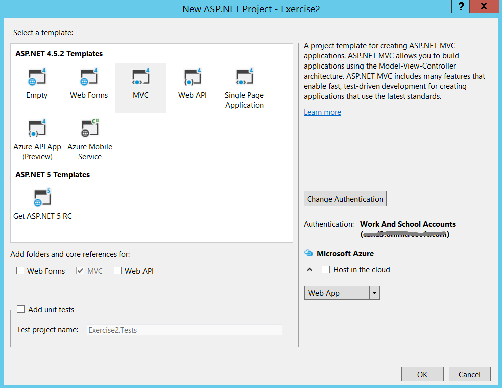
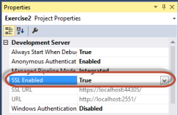
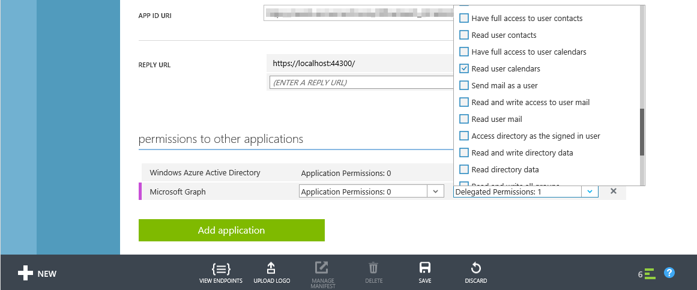

# Getting started in Office 365 with the Microsoft Graph API
In this lab, you will investigate the Microsoft Graph.

## Prerequisites
1. You must have an Office 365 tenant to complete this lab. If you do not have one, the lab for **O3651-7 Setting up your Developer environment in Office 365** shows you how to obtain a trial.

## Exercise 1: Create & Configure an MVC Web Application
In this exercise you will create a new MVC web application to utilize the Microsoft Graph.

1. Open Visual Studio, sign in with your **Organizational Account** by clicking the **Sign in** button on the top right corner.

	
	> **Note:** Visual studio will create web application in Azure automatically with this account when creating the project.
1. In Visual Studio, click **File/New/Project**.
1. In the **New Project** dialog
  1. Select **Templates/Visual C#/Web**.
  1. Select **ASP.NET Web Application**.
  2. For the project name, enter **Exercise**,

    
    > **Note:** Make sure you enter the exact same name for the Visual Studio Project that is specified in these lab instructions.  The Visual Studio Project name becomes part of the namespace in the code.  The code inside these instructions depends on the namespace matching the Visual Studio Project name specified in these instructions.  If you use a different project name the code will not compile unless you adjust all the namespaces to match the Visual Studio Project name you enter when you create the project.

  1. Click **OK**.
1. In the **New ASP.NET Project** dialog
  1. Click **MVC**.
  2. Click the **Change Authentication** button.
  3. Select **Work And School Accounts**.
  4. Select **Cloud - Single Organization**
  5. Add your domain in the **Domain** field (for example, contoso.onmicrosoft.com)
  6. Check **Read directory data** under Directory Access Permissions 
  7. Click **OK**.
  8. Uncheck **Host in the cloud**
  9. Click **OK**.

    

    

1. Update the web project to use SSL by default:
  1. In the **Solution Explorer** tool window, select the project and look at the **Properties** tool window. 
  1. Change the property **SSL Enabled** to **TRUE**.
  1. Copy the **SSL URL** property to the clipboard for use in the next step.
  1. Save your changes.

    
    > It is important to do this now because in the next step when you create the application in Azure AD, you want the reply URL to use HTTPS. If you did not do this now, you would have to manually make the changes the Visual Studio wizard is going to do for you in creating the app.
    
1. Configure the project to always go to the homepage of the web application when debugging:
  1. In the **Solution Explorer** tool window, right click the project and select **Properties**.
  1. Select the **Web** tab in the left margin.
  1. Find the section **Start Action**.
  1. Click the radio button **Start URL** and enter the SSL URL of the web project that you copied from the previous step.
  
1. At this point you can test the authentication flow for your application.
  1. In Visual Studio, press **F5**. The browser will automatically launch taking you to the HTTPS start page for the web application.

   	> **Note:**
   	> 1. If you receive an error that indicates ASP.NET could not connect to the SQL database, please see the [SQL Server Database Connection Error Resolution document](../../SQL-DB-Connection-Error-Resolution.md) to quickly resolve the issue.
   	> 1. If you receive an error of assembly 'System.Spatial', please right click the project, select **Manage Nuget Packages**, then update System.Spatial to the latest version.
   	> 
   	> 

  1. To sign in, click the **Sign In** link in the upper-right corner.
  1. Login using your **Organizational Account**.
  1. Upon a successful login, since this will be the first time you have logged into this app, Azure AD will present you with the common consent dialog that looks similar to the following image:

    

  1. Click **Accept** to approve the app's permission request on your data in Office 365.
  1. You will then be redirected back to your web application. However notice in the upper right corner, it now shows your email address & the **Sign Out** link.

Congratulations... at this point your app is configured with Azure AD and leverages OpenID Connect and OWIN to facilitate the authentication process!

## Exercise 2: Configure Web Application to use Azure AD and OWIN
In this exercise you will take the ASP.NET MVC web application you created in the previous exercise and configure it to use Azure AD & OpenID Connect for user & app authentication. You will do this by utilizing the OWIN framework. Once authenticated, you can use the access token returned by Azure AD to access the Microsoft Graph.


1. Grant App Necessary Permissions.

  1. Browse to the [Azure Management Portal](https://manage.windowsazure.com) and sign in with your **Organizational Account**.

    > **Note:** If the Azure Management Portal pops up a message asking if you want to navigate to the updated Azure Management Portal answer no.

  1. In the left-hand navigation, click **Active Directory**.
  1. Select the directory you share with your Office 365 subscription.
  1. Locate and select the **Applications** tab on the header/options bar.
  1. Search for the application with the **ida:ClientId** that was created in exercise 1 and open it. You can find the Client ID by opening the web.config file at the root of the solution.

    

    
  1. Click the application, then click the **Configure** tab
  1. Scroll down to the **permissions to other applications** section. 
  1. Click the **Add Application** button.
  1. In the **Permissions to other applications** dialog, click the **PLUS** icon next to the **Microsoft Graph** option.
  1. Click the **CHECK** icon in the lower right corner.
  1. For the new **Microsoft Graph** application permission entry, select the **Delegated Permissions** dropdown on the same line and then select the following permissions:
    * **Read user calendars**    
  1. Click the **Save** button at the bottom of the page.

     
1. In the Visual Studio project, add a helper class that will be used to harvest settings out of the `web.config` and create the necessary strings that will be used for authentication:

  1. Right-click the project and select **Add/New Folder**. Give the folder the name **Utils**. 
  1. Locate the [\\\O3651\O3651-5 Getting started in Office 365 with the Microsoft Graph API\Lab\Lab Files](/O3651/O3651-5 Getting started in Office 365 with the Microsoft Graph API/Lab Files) folder provided with this lab and find the [`SettingsHelper.cs`](/O3651/O3651-5 Getting started in Office 365 with the Microsoft Graph API/Lab Files/SettingsHelper.cs) file.  Drag the [`SettingsHelper.cs`](/O3651/O3651-5 Getting started in Office 365 with the Microsoft Graph API/Lab Files/SettingsHelper.cs) file to the **Utils** folder in the project.
      
1. Update **_Layout** file to add **Calendar** link:
    1. Open the **_Layout.cshtml** file found in the **Views/Shared** folder.
      1. Locate the part of the file that includes a few links at the top of the page... it should look similar to the following code:
      
        ````asp
        <div class="navbar-collapse collapse">
          <ul class="nav navbar-nav">
            <li>@Html.ActionLink("Home", "Index", "Home")</li>
            <li>@Html.ActionLink("About", "About", "Home")</li>
            <li>@Html.ActionLink("Contact", "Contact", "Home")</li>
          </ul>
        </div>
        ````

      1. Update that navigation to have a new link (the **Calendar** link added below) as well as a reference to the login control you just created:

        ````asp
        <div class="navbar-collapse collapse">
          <ul class="nav navbar-nav">
            <li>@Html.ActionLink("Home", "Index", "Home")</li>
            <li>@Html.ActionLink("About", "About", "Home")</li>
            <li>@Html.ActionLink("Contact", "Contact", "Home")</li>
            <li>@Html.ActionLink("Calendar", "Index", "Calendar")</li>
          </ul>
          @Html.Partial("_LoginPartial")
        </div>
        ````

        > The **Calendar** link will not work yet... you will add that in the next exercise.

## Exercise 3: Leverage the Microsoft Graph SDK
In this exercise you will add a controller and views that utilize the Microsoft Graph SDK.

1. Add Microsoft Graph package by NuGet:
  1. Click **View/Other Windows/Package Manager Console**.
  1. In the **Package Manager Console**, type **Install-Package Microsoft.Graph** and press **Enter** .
  
     
1. With the authentication process complete, add a new controller that will retrieve events from your calendar:
  1. Right-click the **Models** folder and select **Add/Class**.
    1. In the **Add Class** dialog, give the Class the name **MyEvent** and click **Add**.
    1. Add the following `using` statements after the existing `using` statements in the **MyEvent.cs** file:

    ````c#
	using System.ComponentModel;
	using System.ComponentModel.DataAnnotations;   
    ````

    1. Implement the new class **MyEvent** using the following class definition.
    
    ````c#
    public class MyEvent {           
        [DisplayName("Subject")]
        public string Subject { get; set; }

        [DisplayName("Start Time")]
        [DisplayFormat(DataFormatString = "{0:MM/dd/yyyy}", ApplyFormatInEditMode = true)]
        public DateTimeOffset? Start { get; set; }

        [DisplayName("End Time")]
        [DisplayFormat(DataFormatString = "{0:MM/dd/yyyy}", ApplyFormatInEditMode = true)]
        public DateTimeOffset? End { get; set; }
    }
    ````
  1. In the solution explorer, right-click the **Controllers** folder and select **Add/Controller**.
    1. In the **Add Scaffold** dialog, select **MVC 5 Controller - Empty** and click **Add**.
    1. In the **Add Controller** dialog, give the controller the name **CalendarController** and click **Add**.
  1. Add the following `using` statements after the existing `using` statements in the **CalendarController.cs** file:

    ````c#
	using Exercise.Utils;
	using Microsoft.IdentityModel.Clients.ActiveDirectory;
	using System.Security.Claims;
	using System.Threading.Tasks;
	using Exercise.Models;
	using System.Net.Http.Headers;
	using Microsoft.Graph;    
    ````

  1. Decorate the controller to only allow authenticated users to execute it by adding the `[Authorize]` attribute on the line immediately before the controller declaration:

    ````c#
    namespace Exercise.Controllers {
      [Authorize]
      public class CalendarController : Controller {}
    }
    ````

  1. Create a method `GetGraphAccessTokenAsync` to get access token for Microsoft Graph API Authentication:

    ````c#
    public async Task<string> GetGraphAccessTokenAsync()
    {
        var signInUserId = ClaimsPrincipal.Current.FindFirst(ClaimTypes.NameIdentifier).Value;
        var userObjectId = ClaimsPrincipal.Current.FindFirst(SettingsHelper.ClaimTypeObjectIdentifier).Value;

        var clientCredential = new ClientCredential(SettingsHelper.ClientId, SettingsHelper.ClientSecret);
        var userIdentifier = new UserIdentifier(userObjectId, UserIdentifierType.UniqueId);

        // create auth context
        AuthenticationContext authContext = new AuthenticationContext(SettingsHelper.AzureAdAuthority, new ADALTokenCache(signInUserId));
        var result = await authContext.AcquireTokenSilentAsync(SettingsHelper.AzureAdGraphResourceURL, clientCredential, userIdentifier);

        return result.AccessToken;
    }
    ````

 1. Create a method `GetGraphServiceClient` to get GraphServiceClient for calling Microsoft Graph API:

    ````c#
    public static GraphServiceClient GetGraphServiceClient(string token)
    {
        var authenticationProvider = new DelegateAuthenticationProvider(
            requestMessage =>
            {
                requestMessage.Headers.Authorization = new AuthenticationHeaderValue("Bearer", token);
                return Task.FromResult(0);
            });

        return new GraphServiceClient(SettingsHelper.GraphResourceUrl, authenticationProvider);
    }
    ````

  1. Modify the `Index()` method to be asynchronous by adding the `async` keyword and modifying the return type:

    ````c#
    public async Task<ActionResult> Index() {}
    ````
  1. In the `Index()` method, use the `GraphServiceClient` to call Microsoft Graph API to retrieve the first 20 events in the user's calendar:

    ````c#
    var eventsResults = new List<MyEvent>();
    var accessToken = await GetGraphAccessTokenAsync();

    try
    {
        var graphService = GetGraphServiceClient(accessToken);
        var request = graphService.Me.Events.Request(new Option[] { new QueryOption("top", "20"), new QueryOption("skip", "0") });
        var userEventsCollectionPage = await request.GetAsync();
        foreach (var evnt in userEventsCollectionPage)
        {
            eventsResults.Add(new MyEvent
            {
                Subject = !string.IsNullOrEmpty(evnt.Subject) ? evnt.Subject : string.Empty,
                Start = !string.IsNullOrEmpty(evnt.Start.DateTime) ? DateTime.Parse(evnt.Start.DateTime) : new DateTime(),
                End = !string.IsNullOrEmpty(evnt.End.DateTime) ? DateTime.Parse(evnt.End.DateTime) : new DateTime()

            });
        }
    }
    catch (Exception el)
    {
        el.ToString();
    }

    ViewBag.Events = eventsResults.OrderBy(c => c.Start);
    ````
  
  The last line in the `Index()` method will return the default view for the controller so leave that as is.

1. Save your changes.
1. Finally, update the view to display the results.
  1. Within the `CalendarController` class, right click the `View()` at the end of the `Index()` method and select **Add View**.
  1. Within the **Add View** dialog, set the following values:
    1. View Name: **Index**.
    1. Template: **Empty (without model)**.

    > Leave all other fields blank & unchecked.    
  1. Click **Add**.   
  1. Within the **Views/Calendar/Index.cshtml** file, delete all the code in the file and replace it with the following code:

    ````html
    @{
      ViewBag.Title = "Home Page";
    }
    <div>
      <table>
        <thead>
          <tr>
            <th>Subject</th>
            <th>Start</th>
            <th>End</th>
          </tr>
        </thead>
        <tbody>
          @foreach (var o365Event in ViewBag.Events) {
            <tr>
              <td>@o365Event.Subject</td>
              <td>@o365Event.Start</td>
              <td>@o365Event.End</td>
            </tr>
          }
        </tbody>
      </table>
    </div>
    ````

  1. Save your changes.
1. Run the application by pushing **F5**.

 > **Note:** If you receive an error that indicates ASP.NET could not connect to the SQL database, please see the [SQL Server Database Connection Error Resolution document](../../SQL-DB-Connection-Error-Resolution.md) to quickly resolve the issue. 

  1. You're now prompted to login (if you're not already logged in). Note that if you're not prompted to login immediately, click **Sign in** in the upper-right corner on the homepage.
  2. When prompted, login using your **Organizational Account**.
  3. If prompted, trust the permissions requested by the application.
  4. On the homepage of the application, click the **Calendar** link in the top navigation.
  5. Verify that events appear in the web application.
   

**Congratulations! You have completed your first Microsoft Graph application.**
