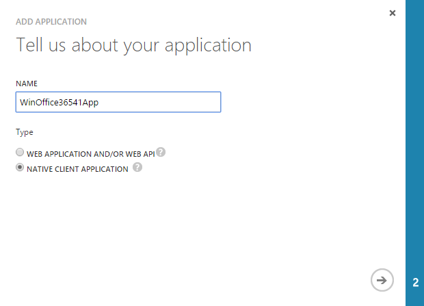
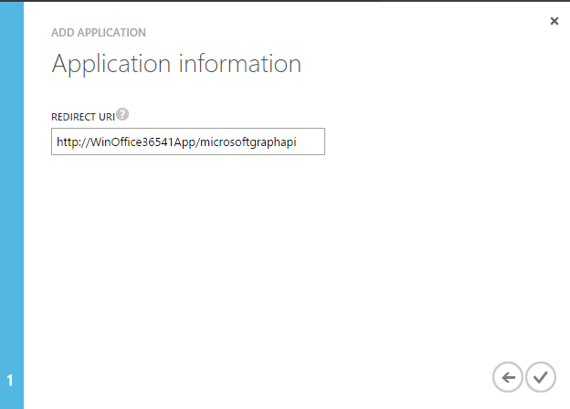
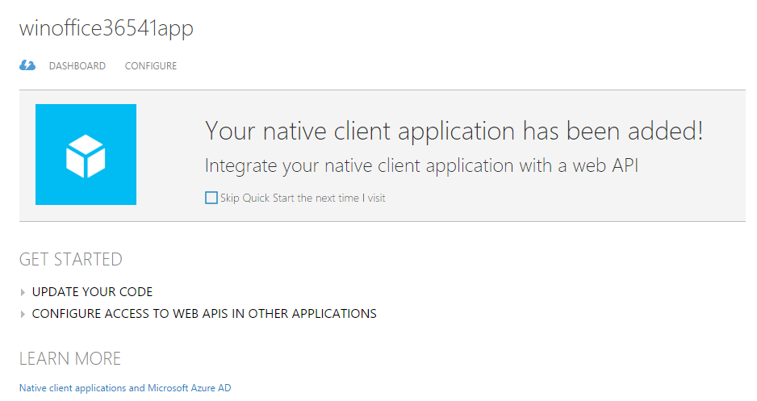
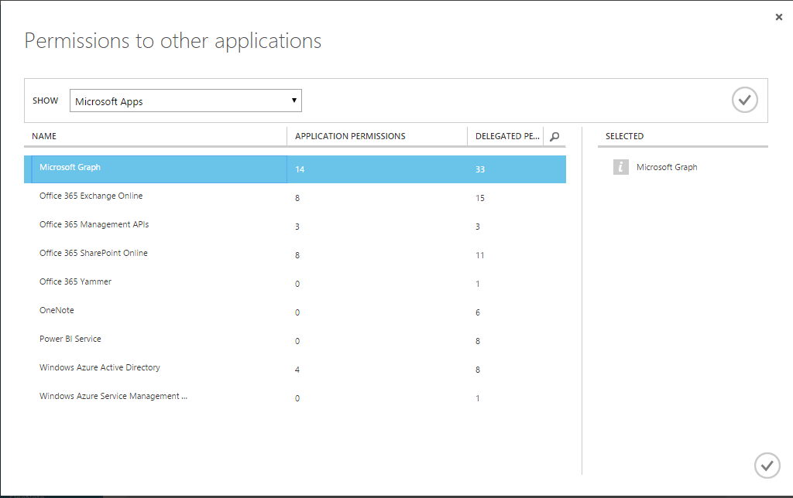
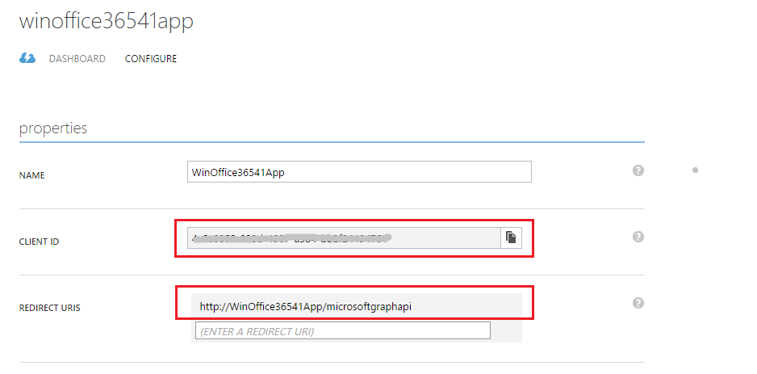
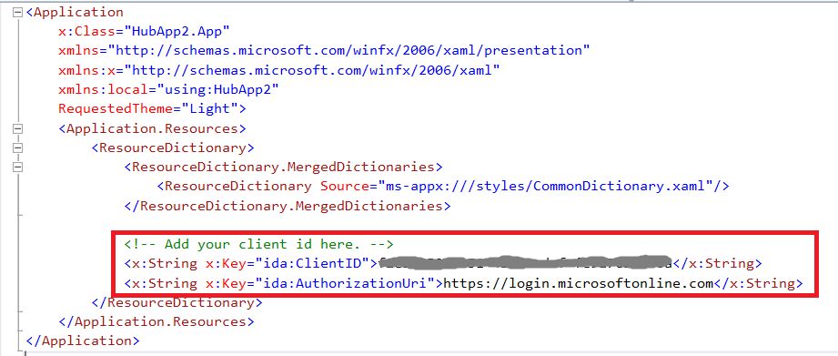
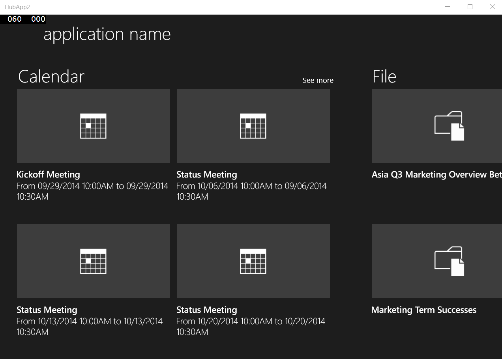

# Deep Dive into native Universal App Development with Microsoft Graph
In this lab, you will use the Microsoft Graph as part of a Windows Store Universal application. The starter project uses the sample data files that are part of the Hub App project. In this lab, you will extend the application to use the Microsoft Graph.

## Prerequisites
1. You must have an Office 365 tenant and Windows Azure subscription to complete this lab. If you do not have one, the lab for **O3651-7 Setting up your Developer environment in Office 365** shows you how to obtain a trial.
1. You must have Visual Studio 2015.
1. You must have the [Windows Software Development Kit (SDK) for Windows 10](https://dev.windows.com/en-us/downloads/windows-10-sdk "Windows SDK") (10.0.10586.0) installed.
1. This lab requires you to use multiple starter files or an entire starter project from the GitHub location. You can either download the whole repo as a zip or clone the repo https://github.com/OfficeDev/TrainingContent.git for those familiar with git.

## Exercise 1: Use the Microsoft Graph in an Native Client Application and Configure the Starter Project
In this exercise, you will use the Microsoft Graph within a Windows 10 application. 

### Register your application with Azure Active Directory
*Your custom Windows 10 application must be registered as an application in Azure AD in order to work, so we will do that now.*

1. Sign into the [Azure Management Portal](https://manage.windowsazure.com/ "Azure Management Portal") using your Office 365 Developer Site credentials.
2. Click **Active Directory** on the left menu, then click on the **directory** for your Office 365 developer site.
3. On the top menu, click **Applications**.
4. Click **Add** from the bottom menu.
5. On the **What do you want to do** page, click **Add an application my organization is developing**.
6. On the **Tell us about your application** page, specify **WinOffice36541App** for the application name and select **NATIVE CLIENT APPLICATION** for Type.

7. Click the arrow icon on the bottom-right corner of the page.
8. On the Application information page, specify a Redirect URI, for this example, you can specify http://WinOffice36541App/microsoftgraphapi. Click the checkbox on the bottom-right corner of the page.

9. Once the application has been successfully added, you will be taken to the Quick Start page for the application. From here, click **Configure** on the top menu.

10. In **permissions to other applications**, click **Add application**.

11. Click **Microsoft Graph**, and then click the check mark icon. 

12. Under **permissions to other applications**, click the **Delegated Permissions** column for **Microsoft Graph**
    - Read files that the user selects
	- Read all files that user can access
	- Read user calendars 
	- Sign in and read user profile
13. Click **Save**
14. Copy the value specified for **Client ID** and **REDIRECT URIS**; you will need this later when coding the **HubApp2** project.


### Prepare the Visual Studio Solution
Next, take an existing starter project and get it ready to write code that will use the Microsoft Graph.

1. Locate the [\\\O3654\O3654-1 Deep dive into native Universal Windows App Development with Office 365 APIs\Lab\Starter](Lab\Starter) folder that contains a starter project that contains the framework of a Windows 10 application that you will update to call the Microsoft Graph using the native for the Microsoft Graph. Open the solution **HubApp2.sln** in Visual Studio.
1. In the Solution Explorer, right-click the **HubApp2** solution node and select **Restore Nuget Packages**.
1. Add the Azure AD application's client ID to the project. Open the **App.xaml** file and locate the XML element with the string **ida:ClientID** in it. Enter your Client ID.



## Exercise 2: Add classes to represent the data returned from the Office 365 service.
In this exercise, you will add classes to the project that will "normalize" the various data types from Office 365. These classes mimic the sample data classes from the starter project. This is intentional, since the focus of this module is on the Office 365 operations, not the XAML data binding. 
*Note: The code listed in this lab can be found in the [\\\O3654\O3654-1 Deep dive into native Universal Windows App Development with Office 365 APIs\Lab\Labfiles](Lab\Labfiles) folder.*

1. Add a class to represent a group of items from Office 365:
	1. In **Solution Explorer**, right-click on the **DataModel** folder in the project and select **Add/New Item...**
	1. In the **Add New Item** dialog, select **Class** and enter the name **O365DataGroup**.
	1. Replace the template code with the following:

		````c#
		using System;
		using System.Collections.Generic;
		using System.Collections.ObjectModel;
		using System.Text;
		
		namespace HubApp2.Data {
		  public class O365DataGroup {
		    public O365DataGroup(String uniqueId, String title, String subtitle, String imagePath, String description) {
		      this.UniqueId = uniqueId;
		      this.Title = title;
		      this.Subtitle = subtitle;
		      this.Description = description;
		      this.ImagePath = imagePath;
		      this.Items = new ObservableCollection<O365DataItem>();
		    }
		
		    public string UniqueId { get; private set; }
		    public string Title { get; private set; }
		    public string Subtitle { get; private set; }
		    public string Description { get; private set; }
		    public string ImagePath { get; private set; }
		    public ObservableCollection<O365DataItem> Items { get; private set; }
		
		    public override string ToString() {
		      return this.Title;
		    }
		  }
		}
		````

1. Add a class to represent items from Office 365:
	1. In **Solution Explorer**, right-click on the **DataModel** folder in the project and select **Add/New Item...**
	1. In the **Add New Item** dialog, select **Class** and enter the name **O365DataItem**.
	1. Replace the template code with the following:

		````c#
		using System;
		using System.Collections.Generic;
		using System.Text;
		
		namespace HubApp2.Data {
		  public class O365DataItem {
		    public O365DataItem(String uniqueId, String title, String subtitle, String imagePath, String description, String content) {
		      this.UniqueId = uniqueId;
		      this.Title = title;
		      this.Subtitle = subtitle;
		      this.Description = description;
		      this.ImagePath = imagePath;
		      this.Content = content;
		    }
		
		    public string UniqueId { get; private set; }
		    public string Title { get; private set; }
		    public string Subtitle { get; private set; }
		    public string Description { get; private set; }
		    public string ImagePath { get; private set; }
		    public string Content { get; private set; }
		
		    public override string ToString() {
		      return this.Title;
		    }
		  }
		}
		````

1. Add a class to serve as the data source for Office 365 data:
	1. In **Solution Explorer**, right-click on the **DataModel** folder in the project and select **Add/New Item...**
	1. In the **Add New Item** dialog, select **Class** and enter the name **O365DataSource**.
	1. Replace the template code with the following:

		````c#
		using System;
		using System.Collections.Generic;
		using System.Collections.ObjectModel;
		using System.Linq;
		using System.Text;
		using System.Threading.Tasks;
		
		namespace HubApp2.Data
		{
		    public sealed class O365DataSource
		    {
		        private static O365DataSource _dataSource = new O365DataSource();
		
		        private ObservableCollection<O365DataGroup> _groups = new ObservableCollection<O365DataGroup>();
		        public ObservableCollection<O365DataGroup> Groups
		        {
		            get { return this._groups; }
		        }
		
		        public static async Task<IEnumerable<O365DataGroup>> GetGroupsAsync()
		        {
		            await _dataSource.GetO365DataGroups();
		            return _dataSource.Groups;
		        }
		
		        private async Task GetO365DataGroups()
		        {
		            if (this._groups.Count != 0)
		            {
		                return;
		            }
		
		            Groups.Add(new O365DataGroup("calendar", "Calendar", "Calendar events", "Assets/event.png",
		                                          "Events from your Office 365 Calendar"));
		            Groups.Add(new O365DataGroup("contacts", "Contacts", "Contacts from the \"People\" page.", "Assets/contact.png",
		                                          "Contacts from your Office 365 \"My Contacts\""));
		            Groups.Add(new O365DataGroup("mail", "Mail", "Messages from your Inbox", "Assets/mail.png",
		                                          "Messages from your Office 365 Inbox."));
		            Groups.Add(new O365DataGroup("files", "Files", "Files from your OneDrive for business", "Assets/files.png",
		                                          "Files from your OneDrive for Business"));
		
		            await Task.WhenAll(Groups.Select(g => GetGroupItemsAsync(g)));
		
		            return;
		        }
		
		        private async Task GetGroupItemsAsync(O365DataGroup group)
		        {
		            switch (group.UniqueId)
		            {
		                case "calendar":
		                    var ops = new O365Helpers.CalendarOperations();
		                    var events = await ops.GetCalendarEvents();
		                    foreach (var item in events)
		                    {
		                        group.Items.Add(new O365DataItem(item.Id, item.Subject, item.LocationName, "Assets/event.png", item.DisplayString, item.BodyContent));
		                    }
		                    break;
		
		                case "files":
		                    var fileOps = new O365Helpers.FileOperations();
		                    var files = await fileOps.GetMyFilesAsync();
		                    foreach (var item in files)
		                    {
		                        group.Items.Add(new O365DataItem(item.Id, item.Name, item.LastModified, "Assets/files.png", item.DisplayName, String.Empty));
		                    }
		                    break;
		
		                default:
		                    break;
		            }
		
		        }
		
		        public static async Task<O365DataGroup> GetGroupAsync(string UniqueId)
		        {
		            return _dataSource.Groups.FirstOrDefault(g => g.UniqueId.Equals(UniqueId));
		        }
		
		        public static async Task<O365DataItem> GetItemAsync(string uniqueId)
		        {
		            O365DataItem result = null;
		
		            foreach (O365DataGroup group in _dataSource.Groups)
		            {
		                result = group.Items.FirstOrDefault(i => i.UniqueId.Equals(uniqueId));
		                if (result != null)
		                {
		                    break;
		                }
		            }
		            return result;
		        }
		    }
		}
		````

1. Assembly references are not added to the shared projects in Universal Apps, rather they are added to the actual client projects. Therefore you need to add the following NuGet packages manually.
	1. Open the Package Manager Console: **View/Other Windows/Package Manager Console**.
	1. Enter each line below in the console, one at a time, pressing **ENTER** after each one. NuGet will install the package and all dependent packages:
	
		````powershell
		PM> Install-Package -Id Microsoft.IdentityModel.Clients.ActiveDirectory
		PM> Install-Package -Id Microsoft.Graph		
		````

1. Add a class to facilitate the authorization to Azure / Office 365:
	1. In **Solution Explorer**, right-click on the **HubApp2** project and choose **Add/New Folder**. Name the folder **O365Helpers**.
	1. Right-click on the **O365Helpers** folder in the **HubApp2** project and select **Add/New Item...**
	1. In the **Add New Item** dialog, select **Class** and enter the name **AuthenticationHelper**.
	1. Replace the template code with the following:

		````c#
		using Windows.Security.Authentication.Web;
		using System;
		using System.Threading.Tasks;
		using Microsoft.IdentityModel.Clients.ActiveDirectory;
		using Windows.Storage;
		using System.Diagnostics;
		using System.Net.Http;
		using System.Net.Http.Headers;
		using Microsoft.Graph;
		
		namespace HubApp2.O365Helpers
		{
		    internal static class AuthenticationHelper
		    {
		        // The ClientID is added as a resource in App.xaml when you register the app with Office 365. 
		        // As a convenience, we load that value into a variable called ClientID. This way the variable 
		        // will always be in sync with whatever client id is added to App.xaml.
		        private static readonly string ClientID = App.Current.Resources["ida:ClientID"].ToString();
		        private static Uri _returnUri = WebAuthenticationBroker.GetCurrentApplicationCallbackUri();
		        public static string AccessToken = null;
		
		        // Properties used for communicating with your Windows Azure AD tenant.
		        // The AuthorizationUri is added as a resource in App.xaml when you register the app with 
		        // Office 365. As a convenience, we load that value into a variable called _commonAuthority, adding _common to this Url to signify
		        // multi-tenancy. This way it will always be in sync with whatever value is added to App.xaml.
		
		        private static readonly string CommonAuthority = App.Current.Resources["ida:AuthorizationUri"].ToString() + @"/Common";
		        public const string ResourceUrl = "https://graph.microsoft.com/";
		
		        // TODO:s Add your redirect URI value here.
		        private static Uri redirectUri = new Uri("http://WinOffice36541App/microsoftgraphapi");
		
		        public static ApplicationDataContainer _settings = ApplicationData.Current.LocalSettings;
		
		        //Property for storing and returning the authority used by the last authentication.
		        //This value is populated when the user connects to the service and made null when the user signs out.
		        private static string LastAuthority
		        {
		            get
		            {
		                if (_settings.Values.ContainsKey("LastAuthority") && _settings.Values["LastAuthority"] != null)
		                {
		                    return _settings.Values["LastAuthority"].ToString();
		                }
		                else
		                {
		                    return string.Empty;
		                }
		
		            }
		
		            set
		            {
		                _settings.Values["LastAuthority"] = value;
		            }
		        }
		
		        //Property for storing the tenant id so that we can pass it to the ActiveDirectoryClient constructor.
		        //This value is populated when the user connects to the service and made null when the user signs out.
		        static internal string TenantId
		        {
		            get
		            {
		                if (_settings.Values.ContainsKey("TenantId") && _settings.Values["TenantId"] != null)
		                {
		                    return _settings.Values["TenantId"].ToString();
		                }
		                else
		                {
		                    return string.Empty;
		                }
		
		            }
		
		            set
		            {
		                _settings.Values["TenantId"] = value;
		            }
		        }
		
		        // Property for storing the logged-in user so that we can display user properties later.
		        //This value is populated when the user connects to the service.
		        static internal string LoggedInUser
		        {
		            get
		            {
		                if (_settings.Values.ContainsKey("LoggedInUser") && _settings.Values["LoggedInUser"] != null)
		                {
		                    return _settings.Values["LoggedInUser"].ToString();
		                }
		                else
		                {
		                    return string.Empty;
		                }
		
		            }
		
		            set
		            {
		                _settings.Values["LoggedInUser"] = value;
		            }
		        }
		
		        // Property for storing the logged-in user email address so that we can display user properties later.
		        //This value is populated when the user connects to the service.
		        static internal string LoggedInUserEmail
		        {
		            get
		            {
		                if (_settings.Values.ContainsKey("LoggedInUserEmail") && _settings.Values["LoggedInUserEmail"] != null)
		                {
		                    return _settings.Values["LoggedInUserEmail"].ToString();
		                }
		                else
		                {
		                    return string.Empty;
		                }
		
		            }
		
		            set
		            {
		                _settings.Values["LoggedInUserEmail"] = value;
		            }
		        }
		
		        //Property for storing the authentication context.
		        public static AuthenticationContext _authenticationContext { get; set; }
		
		        /// <summary>
		        /// Checks that an OutlookServicesClient object is available. 
		        /// </summary>
		        /// <returns>The OutlookServicesClient object. </returns>
		        public static async Task<string> GetGraphAccessTokenAsync()
		        {
		            try
		            {
		                //First, look for the authority used during the last authentication.
		                //If that value is not populated, use CommonAuthority.
		                string authority = null;
		                if (String.IsNullOrEmpty(LastAuthority))
		                {
		                    authority = CommonAuthority;
		                }
		                else
		                {
		                    authority = LastAuthority;
		                }
		
		                // Create an AuthenticationContext using this authority.
		                _authenticationContext = new AuthenticationContext(authority);
		
		                var token = await GetTokenHelperAsync(_authenticationContext, ResourceUrl);
		
		                return token;
		            }
		            // The following is a list of all exceptions you should consider handling in your app.
		            // In the case of this sample, the exceptions are handled by returning null upstream. 
		            catch (ArgumentException ae)
		            {
		                // Argument exception
		                Debug.WriteLine("Exception: " + ae.Message);
		                _authenticationContext.TokenCache.Clear();
		                return null;
		            }
		            catch (Exception e)
		            {
		                Debug.WriteLine("Exception: " + e.Message);
		                _authenticationContext.TokenCache.Clear();
		                return null;
		            }
		        }
		
		        /// <summary>
		        /// Signs the user out of the service.
		        /// </summary>
		        public static void SignOut()
		        {
		            _authenticationContext.TokenCache.Clear();
		
		            //Clean up all existing clients
		            AccessToken = null;
		            //Clear stored values from last authentication.
		            _settings.Values["TenantId"] = null;
		            _settings.Values["LastAuthority"] = null;
		            _settings.Values["LoggedInUser"] = null;
		            _settings.Values["LoggedInUserEmail"] = null;
		
		        }
		
		        // Get an access token for the given context and resourceId. An attempt is first made to 
		        // acquire the token silently. If that fails, then we try to acquire the token by prompting the user.
		        private static async Task<string> GetTokenHelperAsync(AuthenticationContext context, string resourceId)
		        {
		            string accessToken = null;
		            AuthenticationResult result = null;
		            result = await context.AcquireTokenAsync(resourceId, ClientID, redirectUri, new PlatformParameters(PromptBehavior.Auto, true));
		
		            accessToken = result.AccessToken;
		            if (!string.IsNullOrEmpty(accessToken))
		            {
		                //Store values for logged-in user, tenant id, and authority, so that
		                //they can be re-used if the user re-opens the app without disconnecting.
		                _settings.Values["LoggedInUser"] = result.UserInfo.GivenName;
		                _settings.Values["LoggedInUserEmail"] = result.UserInfo.DisplayableId;
		                _settings.Values["TenantId"] = result.TenantId;
		                _settings.Values["LastAuthority"] = context.Authority;
		
		                AccessToken = accessToken;
		            }
		            return accessToken;
		        }
		
		        public static async Task<GraphServiceClient> GetGraphServiceClientAsync()
		        {
		            var accessToken = await GetGraphAccessTokenAsync();
		            var authenticationProvider = new DelegateAuthenticationProvider(
		                (requestMessage) =>
		                {
		                    requestMessage.Headers.Authorization = new AuthenticationHeaderValue("Bearer", accessToken);
		                    return Task.FromResult(0);
		                });
		            return new GraphServiceClient(authenticationProvider);
		        }
		    }
		}
		````
    1. Update the login redirect URI for the application that is sent to Azure when logging in. Locate the line that looks like this:

		````c#
		private static Uri redirectUri = new Uri(" ");
		````
		
	Set the value of the redirectUri string variable to **http://WinOffice36541App/microsoftgraphapi**

1. Add a class to assist with dialog boxes:	
	1. Right-click on the **O365Helpers** folder in the **HubApp2** project and select **Add/New Item...**
	1. In the **Add New Item** dialog, select **Class** and enter the name **MessageDialogHelper**.
	1. Replace the template code with the following:

		````c#
		using System;
		using System.Text;
		using System.Threading.Tasks;
		using Windows.UI.Popups;
		
		namespace HubApp2.O365Helpers
		{
		    internal static class MessageDialogHelper
		    {
		
		        internal static async Task<bool> ShowYesNoDialogAsync(string content, string title)
		        {
		            bool result = false;
		            MessageDialog messageDialog = new MessageDialog(content, title);
		
		            messageDialog.Commands.Add(new UICommand(
		                "Yes",
		                new UICommandInvokedHandler((cmd) => result = true)
		                ));
		            messageDialog.Commands.Add(new UICommand(
		               "No",
		               new UICommandInvokedHandler((cmd) => result = false)
		               ));
		
		            // Set the command that will be invoked by default 
		            messageDialog.DefaultCommandIndex = 0;
		
		            // Set the command to be invoked when escape is pressed 
		            messageDialog.CancelCommandIndex = 1;
		
		            await messageDialog.ShowAsync();
		
		            return result;
		        }
		
		        internal static async void ShowDialogAsync(string content, string title)
		        {
		            MessageDialog messageDialog = new MessageDialog(content, title);
		            messageDialog.Commands.Add(new UICommand(
		               "OK",
		               null
		               ));
		
		            await messageDialog.ShowAsync();
		        }
		
		        #region Exception display helpers
		        // Display details of the exception. 
		        // We are doing this here to help you, as a developer, understand exactly
		        // what exception was received. In a real app, you would
		        // handle exceptions within your code and give a more user-friendly behavior.
		        internal static void DisplayException(Exception exception)
		        {
		            var title = "Connected Services configuration failure";
		            StringBuilder content = new StringBuilder();
		            content.AppendLine("We were unable to connect to Office 365. Here's the exception we received:");
		            content.AppendFormat("Exception: {0}\n\n", exception.Message);
		            content.AppendLine("Suggestion: Make sure you have added the Connected Services to this project as outlined in the Readme file.");
		            MessageDialogHelper.ShowDialogAsync(content.ToString(), title);
		        }
		        #endregion
		    }
		}
		````

1. Add a base class that implements the INotifyPropertyChanged interface. This interface enables the User Interface updates as data is retrieved through the databinding capabilities of XAML.
	1. Right-click on the **O365Helpers** folder in the **HubApp2** project and select **Add/New Item...**
	1. In the **Add New Item** dialog, select **Class** and enter the name **ViewModelBase**.
	1. Replace the template code with the following:
			
		````c#
		using System;
		using System.ComponentModel;
		using System.Runtime.CompilerServices;
		
		namespace HubApp2.ViewModels {
		  /// <summary>
		  /// Base view model for working with Office 365 services.
		  /// </summary>
		  public class ViewModelBase : INotifyPropertyChanged {
		
		    protected bool SetProperty<T>(ref T field, T value, [CallerMemberName] string propertyName = "") {
		      // If the value is the same as the current value, return false to indicate this was a no-op. 
		      if (Object.Equals(field, value))
		        return false;
		
		      // Raise any registered property changed events and indicate to the user that the value was indeed changed.
		      field = value;
		      NotifyPropertyChanged(propertyName);
		      return true;
		    }
		
		    public event PropertyChangedEventHandler PropertyChanged;		
		    protected void NotifyPropertyChanged([CallerMemberName]string propertyName = "") {
		      if (PropertyChanged != null)
		        PropertyChanged(this, new PropertyChangedEventArgs(propertyName));
		    }
		  }
		}
		````

1. Add a class to represent the data returned from Calendar operations:
	1. Right-click on the **O365Helpers** folder in the **HubApp2** project and select **Add/New Item...**
	1. In the **Add New Item** dialog, select **Class** and enter the name **LoggingViewModel**.
	1. Replace the template code with the following:

		````c#
		using HubApp2.ViewModels;

		namespace HubApp2.O365Helpers {
		  public class LoggingViewModel : ViewModelBase {
		    public static LoggingViewModel Instance { get; private set; }
		
		    static LoggingViewModel() {
		      Instance = new LoggingViewModel();
		    }
		
		    private string _information;
		
		    public string Information {
		      get {
		        return _information;
		      }
		      set {
		        SetProperty(ref _information, value);
		      }
		    }
		  }
		}
		````

1. Add a class to represent the data returned from Calendar operations:
	1. Right-click on the **O365Helpers** folder in the **HubApp2** project and select **Add/New Item...**
	1. In the **Add New Item** dialog, select **Class** and enter the name **EventViewModel**.
	1. Replace the template code with the following:

		````c#
		using HubApp2.O365Helpers;
		using System;
		using Windows.Globalization.DateTimeFormatting;
		
		namespace HubApp2.ViewModels
		{
		    /// <summary>
		    /// Models a calendar event
		    /// </summary>
		    public class EventViewModel : ViewModelBase
		    {
		        public EventViewModel()
		        {
		        }
		
		        private string _id;
		        private string _subject;
		        private string _locationDisplayName;
		        private bool _isNewOrDirty;
		        private DateTimeOffset _start;
		        private DateTimeOffset _end;
		        private TimeSpan _startTime;
		        private TimeSpan _endTime;
		        private string _body;
		        private string _attendees;
		        private string _displayString;
		
		        public string Id
		        {
		            get { return _id; }
		            set { _id = value; }
		        }
		        public string Subject
		        {
		            get { return _subject; }
		            set
		            {
		                if (SetProperty(ref _subject, value))
		                {
		                    IsNewOrDirty = true;
		                    UpdateDisplayString();
		                }
		            }
		        }
		        public string LocationName
		        {
		            get { return _locationDisplayName; }
		            set
		            {
		                if (SetProperty(ref _locationDisplayName, value))
		                {
		                    IsNewOrDirty = true;
		                    UpdateDisplayString();
		                }
		
		            }
		        }
		        public DateTimeOffset Start
		        {
		            get { return _start; }
		            set
		            {
		                if (SetProperty(ref _start, value))
		                {
		                    IsNewOrDirty = true;
		                    UpdateDisplayString();
		                }
		            }
		        }
		        public TimeSpan StartTime
		        {
		            get { return _startTime; }
		            set
		            {
		                if (SetProperty(ref _startTime, value))
		                {
		                    IsNewOrDirty = true;
		                    this.Start = this.Start.Date + _startTime;
		                    UpdateDisplayString();
		                }
		            }
		        }
		        public DateTimeOffset End
		        {
		            get { return _end; }
		            set
		            {
		                if (SetProperty(ref _end, value))
		                {
		                    IsNewOrDirty = true;
		                    UpdateDisplayString();
		                }
		            }
		        }
		        public TimeSpan EndTime
		        {
		            get { return _endTime; }
		            set
		            {
		                if (SetProperty(ref _endTime, value))
		                {
		                    IsNewOrDirty = true;
		                    this.End = this.End.Date + _endTime;
		                    UpdateDisplayString();
		                }
		            }
		        }
		        public string BodyContent
		        {
		            get { return _body; }
		            set
		            {
		                if (SetProperty(ref _body, value))
		                {
		                    IsNewOrDirty = true;
		                }
		            }
		        }
		        public string Attendees
		        {
		            get { return _attendees; }
		            set
		            {
		                if (SetProperty(ref _attendees, value))
		                {
		                    IsNewOrDirty = true;
		                }
		            }
		        }
		
		        public bool IsNewOrDirty
		        {
		            get { return _isNewOrDirty; }
		            set
		            {
		                if (SetProperty(ref _isNewOrDirty, value))
		                {
		                    UpdateDisplayString();
		                    LoggingViewModel.Instance.Information = "Press the Update Event button and we'll save the changes to your calendar";
		                }
		            }
		        }
		
		        public string DisplayString
		        {
		            get { return _displayString; }
		            set
		            {
		                SetProperty(ref _displayString, value);
		            }
		        }
		
		        public void UpdateDisplayString()
		        {
		            DateTimeFormatter dateFormat = new DateTimeFormatter("month.abbreviated day hour minute");
		
		            var startDate = (this.Start == DateTimeOffset.MinValue) ? string.Empty : dateFormat.Format(this.Start);
		            var endDate = (this.End == DateTimeOffset.MinValue) ? string.Empty : dateFormat.Format(this.End);
		
		            DisplayString = String.Format("Subject: {0} Location: {1} Start: {2} End: {3}",
		                    Subject,
		                    LocationName,
		                    startDate,
		                    endDate
		                    );
		            DisplayString = (this.IsNewOrDirty) ? DisplayString + " *" : DisplayString;
		        }
		    }
		}
		````

1. Add a class to facilitate the Calendar operations:
	1. Right-click on the **O365Helpers** folder in the **HubApp2** project and select **Add/New Item...**
	1. In the **Add New Item** dialog, select **Class** and enter the name **CalendarOperations**.
	1. Replace the template code with the following:

		````c#
		using System;
		using System.Collections.Generic;
		using System.Text;
		using System.Threading.Tasks;
		using HubApp2.ViewModels;
		using Newtonsoft.Json.Linq;
		using System.Text.RegularExpressions;
		using System.Linq;
		using Microsoft.Graph;
		
		namespace HubApp2.O365Helpers
		{
		    /// <summary>
		    /// Contains methods for accessing events in a calendar.
		    /// </summary>
		    internal class CalendarOperations
		    {
		        internal async Task<List<EventViewModel>> GetCalendarEvents()
		        {
		            var eventsResults = new List<EventViewModel>();
		
		            try
		            {
		                var graphClient = await AuthenticationHelper.GetGraphServiceClientAsync();
		                var eventsPage = await graphClient.Me.Calendar.Events.Request().Top(10).Filter(string.Format("End/DateTime ge '{0}'", DateTime.Now.ToString("yyyy/MM/dd HH:mm"))).GetAsync();
		                var events = eventsPage.CurrentPage;
		                foreach (var item in events)
		                {
		                    EventViewModel calendarEventModel = new EventViewModel();
		                    calendarEventModel.Subject = item.Subject;
		                    calendarEventModel.Start = DateTime.Parse(item.Start.DateTime);
		                    calendarEventModel.End = DateTime.Parse(item.End.DateTime);
		                    calendarEventModel.Id = item.Id;
		                    calendarEventModel.LocationName = item.Location.DisplayName;
		                    calendarEventModel.StartTime = calendarEventModel.Start.ToLocalTime().TimeOfDay;
		                    calendarEventModel.EndTime = calendarEventModel.End.ToLocalTime().TimeOfDay;
		                    string bodyType = item.Body.ContentType == BodyType.Html ? "html" : "text";
		                    string bodyContent = item.Body.Content;
		                    if (item.Body.ContentType == BodyType.Html)
		                    {
		                        bodyContent = Regex.Replace(bodyContent, "<[^>]*>", "");
		                        bodyContent = Regex.Replace(bodyContent, "\n", "");
		                        bodyContent = Regex.Replace(bodyContent, "\r", "");
		                    }
		                    calendarEventModel.BodyContent = bodyContent;
		
		                    calendarEventModel.Attendees = BuildAttendeeList(item.Attendees);
		
		                    calendarEventModel.UpdateDisplayString();
		                    eventsResults.Add(calendarEventModel);
		                }
		            }
		            catch (Exception el)
		            {
		                el.ToString();
		            }
		
		            return eventsResults.OrderBy(e => e.Start).ToList();
		        }
		
		        /// <summary>
		        /// Builds a semi-colon delimted list of attendee email addresses from
		        /// the Attendee collection of a calendar event
		        /// </summary>
		        /// <param name="attendees">IEnumerable<Attendee> attendees</param>
		        /// <returns></returns>
		        internal string BuildAttendeeList(IEnumerable<Attendee> attendees)
		        {
		            StringBuilder attendeeListBuilder = new StringBuilder();
		            foreach (Attendee attendee in attendees)
		            {
		                var address = attendeeListBuilder.Length > 0 ? ";" : string.Empty;
		                address += attendee.EmailAddress.Address;
		                attendeeListBuilder.Append(attendee.EmailAddress.Address);
		            }
		            return attendeeListBuilder.ToString();
		        }
		    }
		}
		````

1. Add a class to represent the data returned from File operations:
	1. Right-click on the **O365Helpers** folder in the **HubApp2** project and select **Add/New Item...**
	1. In the **Add New Item** dialog, select **Class** and enter the name **FileSystemItemViewModel**.
	1. Replace the template code with the following:

		````c#
		using System;

		namespace HubApp2.ViewModels
		{
		    /// <summary>
		    /// Contains the files that are used in the view model.
		    /// </summary>
		    public class FileSystemItemViewModel
		    {
		        private string _name;
		        private string _folder;
		        private string _id;
		        private string _lastModifiedBy;
		        private DateTimeOffset _lastModifiedDateTime;
		        public string Folder
		        {
		            get { return _folder; }
		            set { _folder = value; }
		        }
		        /// <summary>
		        /// The DisplayName property is the property path used in the 
		        /// DisplayMemberPath property in the ListBox control that is
		        /// bound to the ViewModel.
		        /// </summary>
		        public string DisplayName
		        {
		            get
		            {
		                if (!string.IsNullOrEmpty(Folder))
		                {
		                    return _name + " (folder)";
		                }
		                else {
		                    return _name;
		                }
		            }
		        }
		        public DateTimeOffset LastModifiedDateTime
		        {
		            get { return _lastModifiedDateTime; }
		            set { _lastModifiedDateTime = value; }
		        }
		        public string LastModifiedBy
		        {
		            get { return _lastModifiedBy; }
		            set { _lastModifiedBy = value; }
		        }
		
		        public string LastModified
		        {
		            get
		            {
		                return String.Format("Last modified by {0} on {1:d}",
		                                    LastModifiedBy,
		                                    LastModifiedDateTime);
		            }
		        }
		        public string Id
		        {
		            get { return _id; }
		            set { _id = value; }
		        }
		        public string Name
		        {
		            get { return _name; }
		            set { _name = value; }
		        }
		
		        public override string ToString()
		        {
		            return _name;
		        }
		    }
		}
		````

1. Add a class to facilitate the File operations:
	1. Right-click on the **O365Helpers** folder in the **HubApp2** project and select **Add/New Item...**
	1. In the **Add New Item** dialog, select **Class** and enter the name **FileOperations**.
	1. Replace the template code with the following:

		````c#
		using HubApp2.ViewModels;
		using System;
		using System.Collections.Generic;
		using System.Threading.Tasks;
		using Newtonsoft.Json.Linq;
		using System.Linq;
		
		namespace HubApp2.O365Helpers
		{
		    /// <summary>
		    /// Contains methods for accessing the files and folders.
		    /// </summary>
		    public class FileOperations
		    {
		        /// <summary>
		        /// Performs a search of the default Documents folder. Displays the first page of results.
		        /// </summary>
		        /// <returns>A collection of information that describes files and folders.</returns>
		        internal async Task<List<FileSystemItemViewModel>> GetMyFilesAsync()
		        {
		            var fileResults = new List<FileSystemItemViewModel>();
		
		            try
		            {
		                var graphClient = await AuthenticationHelper.GetGraphServiceClientAsync();
		                var driveItems = await graphClient.Me.Drive.Root.Children.Request().GetAsync();
		                foreach (var item in driveItems)
		                {
		                    FileSystemItemViewModel fileItemModel = new FileSystemItemViewModel();
		                    fileItemModel.Name = item.Name;
		                    fileItemModel.LastModifiedBy = item.LastModifiedBy.User.DisplayName;
		                    fileItemModel.LastModifiedDateTime = item.LastModifiedDateTime.GetValueOrDefault(new DateTimeOffset());
		                    fileItemModel.Id = item.Id;
		                    fileItemModel.Folder = item.Folder != null ? item.Folder.ToString() : string.Empty;
		                    fileResults.Add(fileItemModel);
		                }
		            }
		            catch (Exception el)
		            {
		                el.ToString();
		            }
		
		            return fileResults.OrderBy(e => e.Name).ToList();
		        }
		    }
		}
		````

## Exercise 3: Modify the pages to use the Office 365 classes
In this exercise, you will replace calls to the sample data source with calls to the Office 365 data source created in the previous exercise.

1. In **Solution Explorer**, expand the **HubApp2.Windows** project. Locate and open the file **HubPage.xaml.cs**
	1. In the **NavigationHelper_LoadState**, locate the call to the sample data source:

		````c#    
	    var calendarDataGroup = await SampleDataSource.GetGroupAsync("Group-1");
	    this.DefaultViewModel["CalendarItems"] = calendarDataGroup;
	    var contactDataGroup = await SampleDataSource.GetGroupAsync("Group-2");
	    this.defaultViewModel["ContactItems"] = contactDataGroup;
	    var mailDataGroup = await SampleDataSource.GetGroupAsync("Group-3");
	    this.defaultViewModel["MailItems"] = mailDataGroup;
		````
	
		Replace those lines with the following:

		````c#
		var groups = await O365DataSource.GetGroupsAsync();
		this.DefaultViewModel["CalendarItems"] = 
			groups.First(g => g.UniqueId.Equals("calendar"));
		this.defaultViewModel["FileItems"] = 
			groups.First(g => g.UniqueId.Equals("files"));
		````

    1. In the **Hub_SectionHeaderClick** method, locate the line:

		````c#
		this.Frame.Navigate(typeof(SectionPage), ((SampleDataGroup)group).UniqueId);
		````

		Replace the **SampleDataGroup** class with the **O365DataGroup** class.

		````c#
		this.Frame.Navigate(typeof(SectionPage), ((O365DataGroup)group).UniqueId);
		````
			
    1. Similarly, in the **ItemView_ItemClick** method, locate the line:  

		````c#
		var itemId = ((SampleDataItem)e.ClickedItem).UniqueId;
		````

		Replace the **SampleDataItem** class with the **O365DataItem** class.

		````c#
		var itemId = ((O365DataItem)e.ClickedItem).UniqueId;
		````

1. In **Solution Explorer**, locate and open the file **SectionPage.xaml.cs**
    1. In the **NavigationHelper_LoadState**, locate the call to the sample data source:

		````c#		
		var group = await SampleDataSource.GetGroupAsync((string)e.NavigationParameter);
		````
            	
		Replace those lines with the following:

		````c#
		var group = await O365DataSource.GetGroupAsync((string)e.NavigationParameter);
		````

	1. In the **ItemView_ItemClick** method, locate the line:  

		````c#
		var itemId = ((SampleDataItem)e.ClickedItem).UniqueId;
		````

		Replace the **SampleDataItem** class with the **O365DateItem** class.

		````c#
		var itemId = ((O365DataItem)e.ClickedItem).UniqueId;
		````

1. In **Solution Explorer**, locate and open the file **ItemPage.xaml.cs**
	1. In the **NavigationHelper_LoadState**, locate the call to the sample data source:

		````c#		
		var item = await SampleDataSource.GetItemAsync((string)e.NavigationParameter);
		````
            	
		Replace those lines with the following:

		````c#
		var item = await O365DataSource.GetItemAsync((string)e.NavigationParameter);
		````
 
1. Configure the debug mode in VS. Press **F5** to run the program.

   

1. When you see all of data returned from Calendar and File, app runs successfully.

   

> When running the application, make sure to give it time to download data. If you try to click on the tabs or items before acquiring data from Office 365, you will have issues. 